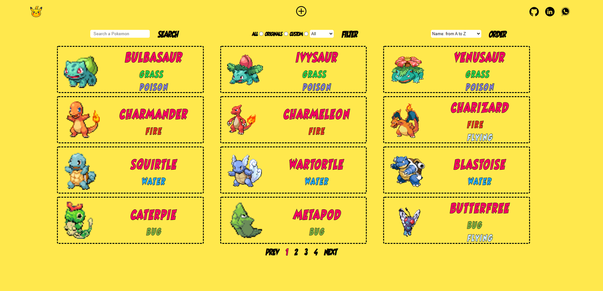
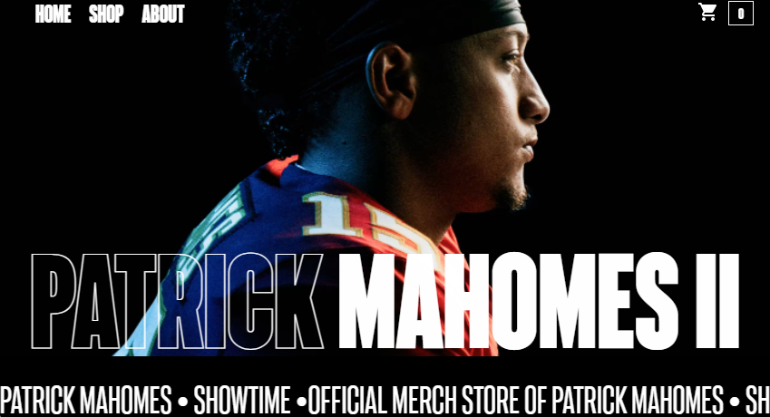
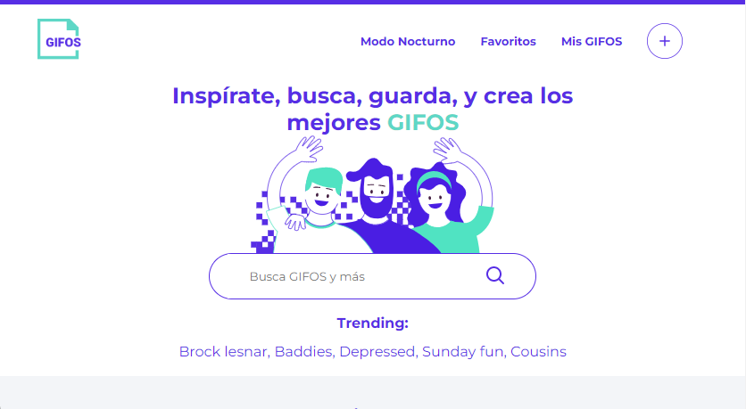

<h1 align="center" >
 Full Stack Developer - from 🌎 Argentina with ❤️
</h1>

&nbsp;
&nbsp;

<h2 align="left" >
⚡️ Techs and Tools:
</h2>

 
 

  <code></code>
  <code></code>
  <code></code>
  <code></code>
  <code></code>
  <code></code>
  <code></code>
  <code></code>
  <code></code>
  <code></code>
   

 

<h2 align="left" >
🚀 Some Proyects:
</h2>

 
<h3 align="left" >
Pokemon App
</h3>

  <b>React, Sass, Express, Sequelize</b>. 
  <ul>
     <li>Fetch pokemons from an external api.</li>
     <li>Create pokemons, POST and save them into a Relational DB (postgreSQL).</li>
     <li>Search, filter and order forms.</li>
     <li>State managment: <b>Redux</b>.</li>
  </ul>

<a href="https://pi-pokemon-topaz.vercel.app/home">
  

   
   

</a>

 
<h3 align="left" >
E-Commerce - Patrick Mahomes
</h3>

  <b>React, Context Api, Sass, FireStore</b>. 
  <ul>
     <li>Patrick Mahomes clone store.</li>
     <li>Navigate through the store for Patrick's products.</li>
     <li>Responsive Design.</li>
     <li>State managment: <b>Context Api</b>.</li>
  </ul>

<a href="https://patmahomes-store-coderhouse.web.app/">
  

   
   

</a>

 
<h3 align="left" >
Giphos App.
</h3>

  <b>Html, Sass, Vanilla Javascript</b>. 
  <ul>
     <li>Access to your camera and create your own Gipho.</li>
     <li>Search any gipho you want (external Giphy api).</li>
     <li>Store them in favorites (localStorage).</li>
     <li>Responsive Design. Light / Dark modes.</li>
  </ul>

<a href="https://urreita9.github.io/giphos/">
  

   
   

</a>
 

                    
- 💞️ I’m looking to work on a dev team.
- 📫 You can email me at francisco.urrea9@gmail.com or enter my portfolio site: https://www.franciscourrea.com.ar

<!---
urreita9/urreita9 is a ✨ special ✨ repository because its `README.md` (this file) appears on your GitHub profile.
You can click the Preview link to take a look at your changes.
--->

<a href="https://www.franciscourrea.com.ar">
  

   
   

</a>
